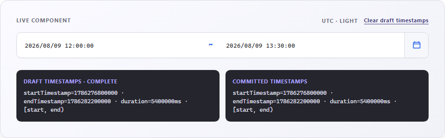

# Timestamp-first React date-time range picker

[](https://www.npmjs.com/package/@ntustray/react-datetime-range-picker)
[](https://github.com/ntustRay/react-datetime-range-picker/actions/workflows/ci.yml)
[](LICENSE)


A controlled React range picker for analytics, charts, logs, and event filters.
It accepts and returns **Unix epoch milliseconds** while an IANA timezone
controls display and editing only.

[Live demo](https://ntustray.github.io/react-datetime-range-picker/) ·
[Public API](docs/PUBLIC_API.md) ·
[Localization](docs/LOCALIZATION.md) ·
[v0.2.0 milestone](docs/V0.2.0_LOCALIZATION_MILESTONE.md) ·
[Changelog](https://github.com/ntustRay/react-datetime-range-picker/blob/main/CHANGELOG.md) ·
[Issues](https://github.com/ntustRay/react-datetime-range-picker/issues)



## Why timestamp-first?

- **Milliseconds in, milliseconds out.** No `Date`, ISO string, or mixed-unit
  public API to normalize in application code.
- **Display timezone is not stored data.** Change the IANA timezone without
  changing the represented instants.
- **Analytics-friendly ranges.** Half-open `[start, end)` semantics avoid
  double-counting boundary events.
- **Draft and commit are distinct.** `onChange` reports valid edits;
  `onCommit` runs only when the user applies a complete range.
- **Accessible and controlled.** Keyboard workflows, validation announcements,
  focus restoration, localization, light/dark themes, and React 18/19 support
  are built in.
- **Zero runtime dependencies.** React and React DOM remain peer dependencies.

## Install

```sh
npm install @ntustray/react-datetime-range-picker
```

Import the stylesheet once:

```ts
import "@ntustray/react-datetime-range-picker/styles.css";
```

## Quick start

```tsx
import { useState } from "react";
import {
  DateTimeRangePicker,
  type DateTimeRangeValue,
} from "@ntustray/react-datetime-range-picker";
import "@ntustray/react-datetime-range-picker/styles.css";

const initialRange: DateTimeRangeValue = {
  startTimestamp: 1_786_276_800_000,
  endTimestamp: 1_786_282_200_000,
};

export function AnalyticsFilter(): React.JSX.Element {
  const [draft, setDraft] = useState(initialRange);
  const [committed, setCommitted] = useState(initialRange);

  return (
    <DateTimeRangePicker
      value={draft}
      onChange={setDraft}
      onCommit={setCommitted}
      timezone="UTC"
    />
  );
}
```

`DateTimeRangeValue` always contains both fields. An empty controlled value is
explicit rather than omitted:

```ts
const emptyRange: DateTimeRangeValue = {
  startTimestamp: null,
  endTimestamp: null,
};
```

## Core controls

| Prop          | Purpose                                                     |
| ------------- | ----------------------------------------------------------- |
| `value`       | Controlled epoch-millisecond draft range                    |
| `onChange`    | Receives each valid draft edit                              |
| `onCommit`    | Receives a complete range when Apply is used                |
| `timezone`    | IANA display/editing timezone; defaults to `"UTC"`          |
| `precision`   | `year` through `millisecond`; defaults to `second`          |
| `constraints` | Minimum, maximum, duration, and step rules                  |
| `presets`     | Consumer-supplied timestamp ranges                          |
| `locale`      | BCP 47 locale for formatting and built-in interface wording |
| `localeText`  | Partial override for visible and accessible wording         |
| `popoverMode` | Floating by default, or `"inline"` in normal document flow  |
| `colorScheme` | Explicit `"light"` or `"dark"` component theme              |

Text fields use `YYYY/MM/DD HH:mm:ss` by default. The picker supports precision
from year through millisecond, 12/24-hour controls, supplied timezone lists,
presets, localized wording, stable test IDs, and configurable feature
visibility. See the [complete public API contract](docs/PUBLIC_API.md).

The picker includes English, Traditional Chinese, Simplified Chinese,
Japanese, Korean, Spanish, French, German, Brazilian Portuguese, and Russian.
It defaults to `"en-US"`. See the [localization guide](docs/LOCALIZATION.md) for
fixed-language and runtime language-switching examples.

## Localization status

Built-in localization is available in `v0.2.0`. The
[localization milestone](docs/V0.2.0_LOCALIZATION_MILESTONE.md) records the
translation terminology, responsive-layout review, package audit, and browser
verification behind the release.

The package also exports `normalizeTimestamp` and `validateDateTimeRange` for
timestamp logic outside React.

## Range contract

- Values are Unix epoch milliseconds.
- A complete range requires `startTimestamp < endTimestamp`.
- Filtering uses `startTimestamp <= timestamp < endTimestamp`.
- UTC is the default display timezone.
- Changing the display timezone never changes the stored timestamps.
- Units below the selected precision normalize to zero.

## Compatibility

- React 18 and React 19
- Modern Chrome, Edge, Firefox, and Safari
- ESM and TypeScript declarations
- Server-side rendering-safe imports
- Node `>=22.18.0` for package tooling and Node-based consumers

## Known limitations

- The package is ESM-only and does not provide native HTML form serialization.
- The calendar displays one month at a time.
- Presentation can be floating or inline, but is not modal or headless.
- Presets and timezone option lists are supplied by the consumer.
- The public API intentionally does not accept `Date` objects or ISO strings.

## Development and release documentation

Repository contributors can use the
[manual build guide](https://github.com/ntustRay/react-datetime-range-picker/blob/main/docs/MANUAL_BUILD_GUIDE.md),
[visual testing guide](https://github.com/ntustRay/react-datetime-range-picker/blob/main/docs/VISUAL_TESTING.md),
and
[CI and npm release guide](https://github.com/ntustRay/react-datetime-range-picker/blob/main/docs/CI_AND_NPM_RELEASE_GUIDE.md).
The
[pre-release audit](https://github.com/ntustRay/react-datetime-range-picker/blob/main/docs/PRE_RELEASE_AUDIT.md)
is the historical evidence snapshot for `0.1.0`, not current release status.

```sh
npm run check
npm run test:e2e
npm run test:visual
npm run test:consumers
```

## Support

Report defects and request features through
[GitHub Issues](https://github.com/ntustRay/react-datetime-range-picker/issues).
That is the supported public contact channel for this package.

## License

[MIT](LICENSE)
